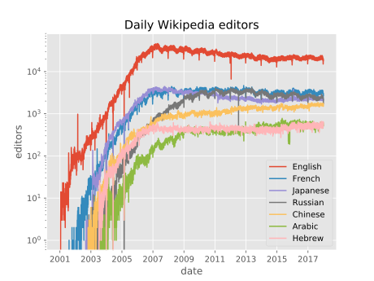
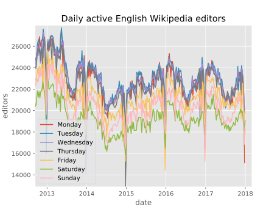
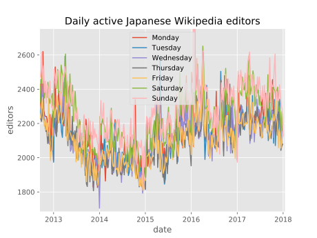
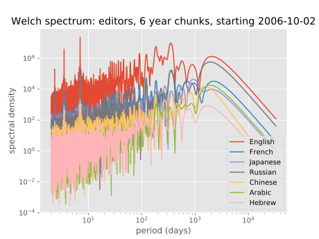
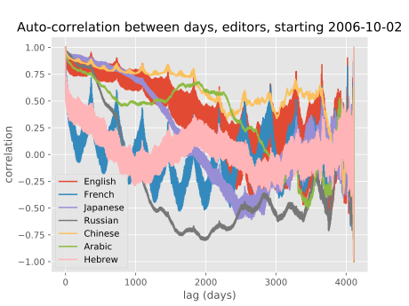
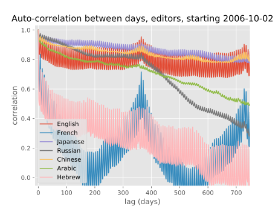

# Wiki at Risk (WaR)

A play on **VaR** (**value at risk**). See Aaron Brown, _Financial risk management for dummies_, chapter six, or Aaron Brown, _Red-blooded risk: the secret history of Wall Street_, but in a nutshell, in finance, the VaR of a fixed portfolio is the amount of money it will lose over one day (or some time horizon) with 95% probability (or some fixed probability). The portfolio is expected to experience losses exceeding this 95% daily VaR five percent of the time, that is, a **VaR break** is expected on average once every twenty days. To quote Brown, "VaR is ***not*** a worst-case outcome. VaR is the best-case outcome on the worst 5 percent of days," so VaR breaks could see (much) heavier losses than the VaR. According to Brown, a good methodology for computing VaR should, in a backtest, produce the right number of breaks, independently distributed over time (i.e., not clumping), and independent of the level of the VaR—in fact, be independent of anything. The discipline of finding data sources and statistical methods that allow a risk manager to consistently produce a good daily VaR is said to provide "crucial advance warnings" of crises (admittedly with many false alarms). Brown: "Time after time in the past, little disturbances in VaR have been the only warning that the markets gave of crises to come; and research to make VaR better always seems to pay off later—usually in totally unexpected ways—in making risk decisions."

**WaR** (**Wiki at Risk**) seeks to estimate and publish good daily 95% VaRs for:
- edits,
- edited pages,
- active editors,

or some combination thereof, for at least the top fifty busiest (identified loosely) Wikipedias, with the goals of
1. identifying the data sets that give us good WaRs, in order to
2. give us early warning of geopolitical or network events that impact global Wikipedia activity.

We wish as much to understand the world through Wikipedia as to understand Wikipedia through the world.

## Yeah, yeah, I know, how do I run this?
Currently there are two pieces:
1. In TypeScript/JavaScript, a package that makes several thousand requests to the Wikimedia analytics server and caches the results as plaintext in a Leveldb, and
2. in Python, a package that transforms the text-based data in Leveldb to numeric data for Numpy and Pandas and friends.

In these instructions, I'll assume you want to do both. So after installing [Git](https://git-scm.com/) and [Node.js](https://nodejs.org/), run the following in your command prompt (each line beginning with a dollar sign, but don't type the dollar sign):
```
$ git clone https://github.com/fasiha/WikiAtRisk.git
$ cd WikiAtRisk
$ npm install
$ npm run build
```
The above will clone this code repository into a new directory (`git …`), enter that directory (`cd …`), intall the JavaScript dependencies (`npm install`, npm being something installed by Node.js), and build the TypeScript source to JavaScript (`npm run …`).

Right now, the only thing this repo does is download a ton of Wikipedia data into a Leveldb database. To get that started, run:
```
$ node downloader.js
```
This fetches a detailed list of [Wikipedia's languages (GitHub)](https://github.com/fasiha/wikipedia-languages/) and then starts downloading several years worth of very interesting data from several Wikipedia projects. It saves the results in the Level database, so feel free to stop and restart the script till you get all the data. The script rate-limits itself so it might take several hours (`MINIMUM_THROTTLE_DELAY_MS` used to be 30 milliseconds, but when I started getting `top-by-edits` data (see below), I increased this to 500 ms). Currently this script hits 130'050 URLs, and the Leveldb weighs roughly 930 megabytes (with Leveldb's automatic compression). If you know TypeScript, you can read [downloader.ts](downloader.ts) to see what all it's doing.

After that finishes, you need to install [Python 3](https://www.python.org/downloads/) (though I recommend [pyenv](https://github.com/pyenv/pyenv)—Clojure and Rust and plenty of other communities have shown us that we shouldn't rely on system-wide installs), then install `virtualenv` by running the following in the command-line (you only have to do this once):
```
$ pip install virtualenv
```
(Pip is the Python installer kind of like how npm is to Node.js.) Next,
```
$ virtualenv .
$ source bin/activate
$ pip install -r requirements.txt --upgrade
```
This creates a virtualenv in the current directory (`virtualenv …`), activates it (`source …`), and installs the libraries that my Python code depends on (`pip …`). After the activation step, your terminal's command prompt should show you some indication that it's in a virtualenv: in my case, it prints a `(WikiAtRisk)` before my prompt. Note that if you open a new terminal window or restart your computer, etc., you need to re-activate the virtualenv to be able to use the packages that it installed: simply rerun `source bin/activate`.

Now you're ready to run the LevelDB-to-xarray ingester:
```
$ python leveltoxarray.py
```
This will spit out several `.nc` NetCDF files that xarray understands. (xarray is a tensor/multidimensional version of Pandas.)

And if you want to make some interesting plots, run
```
$ python eda.py
```
and look at the nice PNGs. (**Work in progress.**)

## Exploratory data analysis

Here are some interesting insights gleaned from some preliminary analysis (keeping in mind [Hamming's motto (SIAM)](http://www.siam.org/news/news.php?id=893), "The purpose of computation is insight, not numbers").

### Figure: Semi-log plot of daily active editors on English, French, Japanese, Russian, Chinese, Arabic, Hebrew, 2001–2017


> (In case its helpful: looking at the rightmost part of the graph, from the top to bottom, the languages are English, then French, Russian, and Japanese in a close cluster, followed by Chinese, then Hebrew and Arabic right on top of each other—you can distinguish these last two because the Arabic Wikipedia started later than the Hebrew one.)
>
> (These languages were chosen semi-randomly from among the top twenty Wikipedias by active editors.)

Note that this plot, of the daily number of editors seen on several Wikipedias, is a [semi-log plot (Wikipedia)](https://en.wikipedia.org/wiki/Semi-log_plot): its y-axis is on the log scale, so each pixel up doesn't *add* an amount to the previous, but *multiplies* it. In other words, straight lines on this semi-log plot mean *exponential* growth or decay (you know, "Exponential growth is the most powerful force in the universe" and all that).

The curves for the English, French, and Japanese Wikipedias show exponential growth in the number of editors from their beginnings in the early 2000s, before hitting Peak Wikipedia on or around 2007, followed by a (much slower) exponential decay.

Gwern's essay, ["In defense of inclusionism"](https://www.gwern.net/In-Defense-Of-Inclusionism) expands on this with a lot of personal detail (personal microhistories are, I believe, an excellent way to learn about something beyond the conventional wisdoms), but in a nutshell, 2007 was when the battle between Wikipedia's inclusionists and deletionists reached a conclusion and the latter won—articles on English Wikipedia at least must be on "notable" topics, so no more articles for each characer in *Pokémon* or *Journey to the West*. This coincided with, or was causally related to, various other changes in editing policy that contributed to the dramatic peak visible here. (For completeness I should probably link to Wikipedia's article, ["Deletionism and inclusionism in Wikipedia"](https://en.wikipedia.org/wiki/Deletionism_and_inclusionism_in_Wikipedia).)

Restricting ourselves to these last several post-peak years, which will no doubt be most relevant to our prediction efforts, of interest to me were the annual dips, noticeable even at this resolution, coinciding with the year-end as editors took their holidays somewhere other than Wikipedia. These curves all show a strong seasonal tendency, so further analysis is called for.

### Figure: Day-of-week trends of the number of editors on English Wikipedia, 2013–2017


I confess that my hypothesis before seeing this was that many more would log in to work on Wikipedia on the weekends (I had the image of the Wikipedian commuting home from work on Friday, tired from the week's work but eager to contribute articles). A quick reshaping of the data, followed by a zoom, gives us this view of the number of daily editors seen on English Wikipedia.

First, clearly, there is a tremendous weekly regularity, over many years. Secondly, my guess was totally wrong. The most editors contribute Monday through Thursday—there is about 3% variability between these four days. Then almost 8% fewer log in on Friday, while Saturday sees almost 17% fewer editors than the Monday–Thursday rush. On Sunday, some editors do return from their day of rest: Sunday sees about 12% fewer editors than Monday–Thursday. Since over this interval (2013 and thereafter), English Wikipedia sees on median 22'920 editors per day on Tuesday, this translates to almost four thousand editors taking Saturday off.

Raw data:

| Day |  Median editors | % of max |
|-----|-----------------|----------|
| Monday | 22,840 | 99.65% |
| Tuesday | 22,920 | 100% |
| Wednesday | 22,591 | 98.56% |
| Thursday | 22,242 | 97.04% |
| Friday | 21,193 | 92.47% |
| Saturday | 19,072 | 83.21% |
| Sunday | 20,255 | 88.37% |

Might this pattern be universal?

### Figure: ditto, Japanese Wikipedia


No, it isn't universal. Japanese Wikipedia for example matches my image of the commuting Wikipedian better:

| Day |  Median editors | % of max |
|-----|-----------------|----------|
| Monday | 2,139 | 93.41% |
| Tuesday | 2,128 | 92.93% |
| Wednesday | 2,118 | 92.49% |
| Thursday | 2,092 | 91.35% |
| Friday | 2,102 | 91.79% |
| Saturday | 2,229 | 97.34% |
| Sunday | 2,290 | 100.00% |

The graph above looks busier and the trend less obvious, but that's mainly because the spread between the day of the week seeing the most editors—Sunday—and the least—Friday—is 8% on Japanese Wikipedia, rather than the 17% on English Wikipedia. Looking closely, the trend sems to be quite stable.

Of course, this "eyeball filter" can be misled, and we should use proper techniques to detect such cyclicities.

### Figure: Welch's spectral estimates for the daily editors seen on English, French, Japanese, Russian, Chinese, Arabic, and Hebrew Wikipedias, post-Peak
My poor PhD advisor co-wrote the book on the topic, [*Spectral Analysis of Signals*](http://www2.ece.ohio-state.edu/~randy/SAtext/), and then taught the class, so forgive me for reaching into what might seem an obscore corner of Scipy and subjecting you to my explanation of [`scipy.signal.welch`](https://docs.scipy.org/doc/scipy/reference/generated/scipy.signal.welch.html). In a nutshell, Welch's method gives us statistical estimates of periodicities in a signal, by estimating the signal's spectral density ("spectral" here as in "spectrum" and related to cyclicities and frequencies, not 妖怪). People use this technique to look for periodicities in animal populations, sunspots, stock data, so this is probably not the weirdest thing it's been applied to. Here are the results:



The x-axis is the period of repetition in days, and the y-axis is the spectral density (a rather unitless figure). The seven languages are thrown on top of one another because I want to highlight points that groups of them seem to share, viz.,

1. all seven show a very strong weekly periodicity: those are the three big peaks on the left, corresponding to 2.33, 3.5, and 7 days, and all languages show a tidy bump there.
2. English, French, and Russian also show a strong periodicity at 365 days—that's the Christmas/New Year holiday dip in the first figure. Chinese shows a weaker annual cycle, while Japanese, Hebrew, and Arabic show no significant annual cyclicity.
3. All languages show the 1/f spectra called pink noise.

Now in more detail.

What's with the peaks at 3.5 and 2.33 days? Are large groups of editors really modulating their editing behavior on a 2.33 day cycle? No, these are harmonics of the main 7 day periodicity. Consider that a pure sinusoid, as the ideal periodic signal, would result in a spectral estimate with a single peak, at the sinusoid's frequency. However, if you corrupt that ideal sinusoid in little ways, like clip its peak a bit, it will still manifest a strong cyclicity at its original period, but the corruptions you've added are also periodic. They won't be pure sinusoids, so they will show up as sinusoids at multiples of their base frequency. Steven Smith's [*Scientist and Engineer's Guide to Digital Signal Processing*](http://www.dspguide.com/ch11/5.htm) has a reasonable explanation and example of this.

Similarly, you can make out numerous ther peaks at periods of 365, 182.5, 121.67, 91.25, 73, 60.83, 52.14, 45.62, 40.56, 36.5, 33.18, 30.42, 28.08, 26.07, 24.33, 22.81, 21.47, 20.28, 19.21, etc. etc., days (these are 365 divided by 2 to 19, and peaks for all of these are present in the English Wikipedia curve—I checked). The stronger the base periodicity, the more of these harmonics you expect to see. Again, I take this to mean *not* that there's some weird 28-day cycle that some Wikipedia editors work on ("if 28 days ago we saw a spike or dip in editor activity, then tomorrow..."), but rather there's a strong annual periodicity.

Outside of these peaks and their harmonics, all languages show a marked decay in spectral density: as the period decreases (that is, as the frequency increases), the spectra also decrease, and furthermore, it decreases linearly on this log-log plot. This is known as 1/f or pink noise (Wikipedia's ["Pink noise"](https://en.wikipedia.org/wiki/Pink_noise) is barely comprehensible but there it is), and these frequently occur in many natural systems. One of the most interesting aspects of 1/f noise is that signals with it have long-term memory, and are heavily-correlated over long timescales. Let's investigate this next.

> One thing that I *don't* have to worry about: aliasing. A perennial problem in sampling signals is that the underlying signal might have activity at a frequency faster than you are sampling at, so you have to low-pass filter the signal in the analog domain before sampling (otherwise the too-high frequencies will show up in your spectra as aliases). However, this is a non-issue here because each sample of the daily editor time series is the sum of discrete events: how many editors made a change over a day. All discrete signal, no aliasing problem.

> DSP nerd note: for Welch's method, I used six-year temporal windows with *no* taper (boxcar window) and with 10% overlap between windows. I chose the boxcar window to maximize spectral resolution (as skinny peaks as possible), in my attempt to establish as many peaks as harmonics of base periodicities. (I also looked for peaks that may have been masked by nearby peaks by using a Hann window, I didn't find anything of interest.) I often take larger overlaps, but chose 10% because that gave more of a difference between the 1/f trend and the peaks of the spectral density. I also asked `scipy.signal.welch` to remove any linear trend in the segments before computing the FFT and averaging.

### Figure: Auto-correlations of the daily editors seen on English, French, Japanese, Russian, Chinese, Arabic, and Hebrew Wikipedias, post-Peak
The *correlation* between two sequences of numbers is a single number between 1 and -1 that indicates the linear trend between them: 1 is perfectly correlated, -1 is perfectly anti-correlated, and 0 means uncorrelated (*no* **linear** trend between them, but as Wikipedia's article on ["Correlation and dependence"](https://en.wikipedia.org/wiki/Correlation_and_dependence) illustrates, emphatically does not mean *no* trend).



The auto-correlation of a long sequence is simply the list of correlations between the sequence and delayed versions of it, which this plot, calculated by repeated calls to [`numpy.corrcoef`](https://docs.scipy.org/doc/numpy/reference/generated/numpy.corrcoef.html), for the seven languages we've been working with. I've restricted this calculation by excluding the exponential run-up to the peak, so I consider only data after 2006 October 2. 
- The auto-correlation at lag 0 is simply the entire sequence of daily editors seen on English Wikipedia correlated by itself: 4109 points.
- The auto-correlation at lag 1, meanwhile, is the correlation between the *first* 4108 samples and the *last* 4108 samples, meaning, correlate the signal by a copy of itself delayed by one day.
- The auto-correlation at lag 7 is something we're very interested in: that's the correlation between each day's editor count with that of a week later (or equivalently, a week ago).
- Similarly, the auto-correlation at lag 365 is the correlation between each day's editor count with that of a year ago or a year later.

I show this highly-zoomed-out plot to answer the question posed in the previous section: in random signals, the auto-correlation drops to and stays at zero after a short number of lags, representing the memory of the process generating it. Signals with pink noise are characterized by very long memory, and that is very obviously what we see here. The main point to note is that the number of editors contributing today is highly correlated with the number of editors seen several months, even years, ago.

I do agree with your next observation, that the French and Hebrew Wikipedias' editor counts' auto-correlation drop off much faster than the others. I am not sure why this is.

But let's investigate this auto-correlation function a little closer:



At lags of up to two years, we can make a couple of points. We can confirm the insight from Welch's spectral estimate: the auto-correlation with one year lags is greater than 0.75 for five out of our seven Wikipedias. There is a marked jump at the 365-day lag for English and especially French Wikipedias, smaller but noticeable bumps for Japanese, Russian, and Chinese Wikipedias, and almost no 365-lag-specific peaks in the Arabic and Hebrew Wikipedias.

The other marked fact is that there's a high-frequency oscillation present in all these auto-correlations. Zooming in a bit further shows us its weekly periodicity:


We see that, to a first degree approximation, all seven languages' Wikipedias show a strong weekly correlation in editors counts. And because today's editor count is highly correlated with those a week ago (and in the future), it's also going to be correlated with those two, three, four, etc. weeks ago (and in the future), thus giving a kind of temporal harmonics.

While the one-week auto-correlations for the French and Hebrew Wikipedias are the lowest out of the seven languages, they are much higher than the 2–6 day auto-correlations, while the Arabic Wikipedia shows the slightest of up-ticks at the one-week mark. Welch's spectral density for Arabic Wikipedia at the one-week period was also very weak. Here's the day-of-week table of median daily editors for the Arabic Wikipedia:

| Day |  Median editors | % of max |
|-----|-----------------|----------|
| Monday | 545 | 100.00% |
| Tuesday | 541 | 99.27% |
| Wednesday | 541 | 99.27% |
| Thursday | 508 | 93.21% |
| Friday | 517 | 94.86% |
| Saturday | 542 | 99.45% |
| Sunday | 544 | 99.82% |

Much of the Arab world has its weekend on Thursday and Friday, and the percentage drop of weekend editors is on the order of the Japanese Wikipedia's spike, but for some reason the auto-correlations are much weaker than Japanese Wikipedia's case.

Let's dig more!

(**In progress.**)

## Data of interest

Source: [Wikipedia REST API](https://wikimedia.org/api/rest_v1/#/).

We download the following:
- `edited-pages/aggregate`: the number of edited pages, daily, between editor types (registered users, bots, and anonymous users)
- `edits`: the total number of edits, daily
- `edited-pages/new`: the number of new pages and who created them, per day
- `editors`: the number of editors active per day, between editor types
- `registered-users`: the daily number of new signups
- `bytes-difference/net`: the daily number of net bytes edited (`added - deleted`), by editor type
- `bytes-difference/absolute`: the daily number of total bytes edited (`added + deleted`)
- `unique-devices`: daily number of unique devices seen, separated by access site (desktop versus mobile site)
- `pageviews`: *daily* (soon hourly!) number of pageviews between access types (desktop browser, mobile browser, and mobile app) and agents (users or crawlers)
- `edited-pages/top-by-edits`: the top hundred most-edited pages for each day, broken down by editor types

all, for the top fifty Wikipedias (by active users), from 2001 to end of 2017. This serves as historical data that's dumped into Leveldb, indexed by the HTTP URL endpoint used to retreive it.

## Languages

(Well, I did have exactly this question: [Why are there so many articles in the Cebuano Wikipedia? (Quora)](https://www.quora.com/Why-are-there-so-many-articles-in-the-Cebuano-language-on-Wikipedia).)

This package uses my [`wikipedia-languages` (GitHub)](https://github.com/fasiha/wikipedia-languages) library to automatically fetch some metadata from [Wikistats](https://wikistats.wmflabs.org) and stores it locally in `wikilangs.json`. We then select the top fifty Wikipedias by active users.

## Next

Up next on the menu: I need to split the data into training and testing sets—I'm thinking two years for training, then set aside one year for testing, for countries with a four-year election cycle, so that the testing periods cycle through all phases of that? I think I want the test set to have increments of a whole year to ensure I can capture seasonality.

The real juice is a statistical methodology to estimate the future probabilistic distributions of the things we want to predict WaR for.

Finally, we'll need some ways of collecting near-real-time data to get daily WaRs. We can use
- [Quarry](https://quarry.wmflabs.org/query/25783) to run SQL queries on current Wikimedia databases (to get lower latency or finer-grained results than the REST API above), or potentially
- [EventStreams](https://stream.wikimedia.org/?doc) which is a high-volume real-time data feed from Wikimedia of many events that will eventually make it into the REST API.

With these in place, we can publish real-time WaRs!